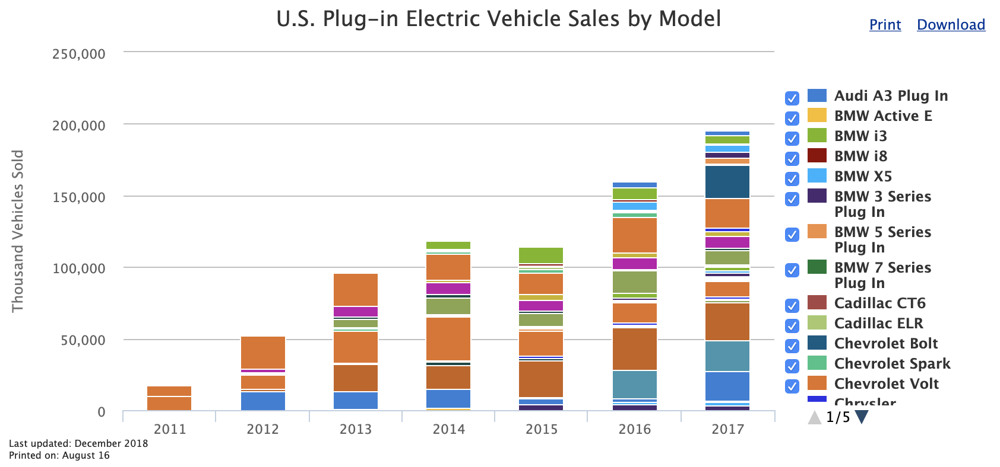

# Batteries Power Politics
*Members: Kylie Tan & Quynh Nhu Bui*

ETL Flow Diagram

## 1)  Project Proposal:
Our goal for this project is to investigate the correlation between the proportion of each US state’s privately owned electric cars and the proportion of each of those states’ total votes in the  2016 Presidential election received by individual political parties. 

Our hypothesis is that states in which Democrat candidates receive larger portions of the total vote compared to Republican candidates also have larger portions of their privately owned car populations made up by privately owned electric vehicles. We are also curious if there is a relationship between these two quantities such that as the proportion of a state’s total votes received by Democrat candidates increases, so does the proportion of that state’s privately owned car population made up by electric vehicles.

Additionally, we would like to understand the relationship between fuel price and the proportion of each US state’s privately owned electric cars. Our hypothesis is that gas prices play a large part in influencing vehicle fuel type choice, and because of this, states with higher average fuel prices will also have higher proportions of  privately owned electric vehicles making up their privately owned car population.

## 2)  Data Sources:
MIT Election Lab ([https://electionlab.mit.edu/data])
Electric Vehicle Registration Counts by State ([https://afdc.energy.gov])
Total Number of Privately Owned Passenger Cars Per State ([https://www.fhwa.dot.gov/])
AAA Gas Price ([https://gasprices.aaa.com/state-gas-price-averages/])

## 3) Extract - Transform - Load:

We built three datasets from four sources of data so we could better explored our question.

### Electric Vehicle (EV) Analysis:
We used two data sources to build our EV analysis dataset. Data extract, transform and load were executed in EV_Registration_By_State_Anlysis Jupyter notebook. Work was done using Python its Pandas library and Pymongo package.

We download the Electric Vehicle Registration Counts by State dataset from the U.S. Department of Energy website (ttps://afdc.energy.gov) and the Total Number of Privately Owned Passenger Cars Per State dataset from U.S. Department of Transportation website (https://www.fhwa.dot.gov/). 

Both datasets are in Excel (xlsm) format. In Jupyter notebook, we used pd.read_excel to read the files and convert them into two Pandas dataframes called "ev_df" and "total_regist_df". "ev_df" displays 51 states and their privately owned EV count in 2017, and "total_regist_df" displays the 51 US states and their total vehicle registration count in 2017. These two datasets had headers, footers and charts which where not relevant to our analysis. To get the specific information we were interested in without the headers and footers, we passed skiprows and skipfooter to pd.read_excel in order to exclude this information.

For the purpose of our analysis, we merged these two dataframes on their “State” columns and the joined dataframe, "registration_df", features state name, EV count, and total vehicle registered by state in 2017 as its columns.

We added a column called "EV Percentage” to registration_df so that we could also display the proportion of privately owned EV in each state. “EV Percentage” was calculated as below: 
“EV Percentage” = “EV Count”/“Total Regist Count”

The last step in our transformation of this data was to turn registration_df into a dictionary. After doing so we created a connection to MongoDB using PyMongo. and loaded the dictionary version of registration_df into the "ev" collection of our MongoDB database, "etl_db". 

### 2016 US presidential election results: 

We were able to download a .csv file from the MIT Election Lab (https://electionlab.mit.edu/data) which contained the results of US presidential elections by state from 1976 to 2016. The results included in this .csv that were relevant to our project were election year, state, party of each major candidate voted for in each state, whether a candidate was a write-in, number of votes received by each candidate, and the total votes cast in each state. 

After reading in our downloaded .csv file as a Pandas dataframe, our first step in readying this data for use was to select the columns relevant to our analysis and filter the data to only include the 2016 presidential elections. Our choice to only consider election data from 2016 was primarily informed by our belief that in the case of this particular analysis, using election data that was collected in as close a time period to that in which our electric vehicle data was generated (2017) would yield the most accurate depiction of any potential relationship between the two quantities. 

While the argument could be made that presidential election data from at least two election years back should be considered since a potentially sizeable portion of the electric vehicles on the road when this data was collected in 2017 may have been sold during those previous time periods.

https://afdc.energy.gov/data/10567

We believe that because our data only reports how many electric vehicles were registered in each state in 2017, and not how many electric vehicles were registered in each state around the times of each presidential election, trying to find correlation between our electric vehicle data and multiple years of election data would only create room for more error in any potential findings.

After filtering the presidential election data for year and selecting the columns of the dataframe relevant to our analysis, we created a column to display the percentage of total votes cast in a state that each candidate received. This was accomplished by dividing the votes received by each candidate by the total votes cast in their state and then multiplying that result by 100 and storing the final result in the new column. This final database was called "votes_per_state_2016_df".

We next created a connection to MongoDB using PyMongo, created a collection called "state_votes" in our "etl_db" database. Following this, we used a for-loop to iterate through a list of the names of the 51 US states and retrieve the names of the major parties voted for in that state, and the number of total votes cast in that state from votes_per_state_2016_df. 

We then used a second for-loop nested within the first  to iterate through the names of the major parties voted for in each state and retrieve the number of votes received by each party’s candidate, and the percentage of the states total votes those votes comprised. A consideration we had not initially planned for was party names that included periods to separate acronym letters, the "U.S. Taxpayer’s Party" for example, and how that would create an issue when attempting to store those party names in a MongoDB document field. We resolved this by using a conditional statement inside the second for-loop that would replace any periods with zero-width space if a party name contained periods.

Lastly, we inserted all of the data we retrieved at  the end of step of the outer for-loop as a document into the "state_votes" collection of "etl_db".

### AAA Gas Price:

We found fuel prices by grade listed for each US state posted on a webpage by the insurance company AAA at https://gasprices.aaa.com/state-gas-price-averages/, and because there was no possibility of downloading this data from the webpage directly, our next course of action was to scrape it using the Python module, Splinter.  

To do this, we created  an instance of Splinter’s Browser class by passing it Chromedriver, a separate executable that WebDriver uses to control Google Chrome, and used this instance to visit the AAA webpage so we could begin scraping the fuel data. Using Chrome DevTools, we explored the AAA webpage and identified the HTML tags encapsulating the fuel data. We then used Splinter’s “.find_link_by_partial_href” and “.find_by_tag” methods to create Splinter element_lists for each partial href or HTML tag we passed them, and initialized variables to hold each of these lists. 
We then used a for-loop to loop through the items in each Splinter element_list and used .text to convert the item into a string, the for-loop then appended each of these strings to their respective lists; "states_list", "regular_list", "mid_grade_list", "premium_list', and "diesel_list" which held the names of each state and their fuel prices by grade. We used these lists to create a Pandas dataframe, "state_fuel_df", and after establishing a connection to our MongoDB database, "etl_db", using the PyMongo module, we used another for-loop to iterate through the rows of state_fuel_df in order to retrieve each state’s name and its fuel prices, and store each state’s data as its own document in our "fuel_prices" collection within "etl_db".

## 4) MongoDB Database:

For this project we chose to use MongoDB instead of SQL because we anticipated: wanting to not have to predefine the structure of our documents before creating them in the Jupyter notebooks we plan to use to run our code, because we would want to be able to add fields as we moved through the code in those notebooks, and because we would have some documents within individual collections that would have their own structures based on the individual nature of the data related to those documents. 

In regard to not having to predefine the structure of the documents in our collections by using MongoDB, we believe that this saved us a substantial amount of time because we were able to initialize the fields within the documents we were creating from our scraped data as we wrote the code in our Jupyter notebooks as opposed to having to stop and think about what data we would be scraping, what type of data it would be (INT, VARCHAR, etc), and what the schemas of each table would be if we were using SQL.

In conjunction with this, we believe that being able to create fields on the fly allowed us to store our data in a more organic fashion and that this also reduced the amount of time we spent finalizing our collections. This became apparent as we realized, midway through our project, that there was more data we would like to store in the documents of certain collections. Instead of having to go back and edit our table schemas if we were using SQL, we were able to simply write a few more lines of code in our Jupyter Notebooks in order to be able to add these fields. 

Lastly, in regard to MongoDB allowing us have documents with unique structures within our collections, this was immensely helpful when we began storing our election data in our database. The data we stored in each election data collection was the year, total votes cast in each state, the names of political parties with candidates that were voted for in each state, the number of votes each of those candidates received, and the percentage of each state's total votes that each cof its candidates' votes made up. Because each state had different political parties whose candidates were voted for, as well as different numbers of candidates who were voted for, having to have each document in our collection have the same structure would not have worked for us. However, with MongoDB, we were able to create documents for each state complete with document structures bespoke to the unique selections of political parties that were voted for in each of those states quickly and easily by using a for-loop in the Jupyter notebook we were running our code from.
